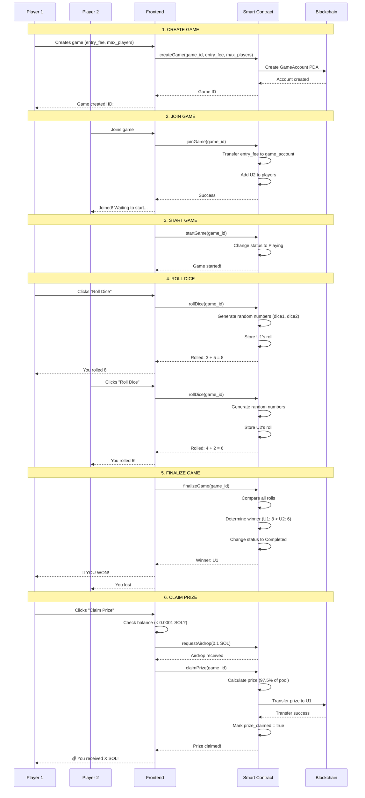

# 🎲 Dice Game - Solana Blockchain Dice Game

A decentralized dice game built on the Solana blockchain, where players bet SOL and the highest dice roll wins!

## 🔗 Quick Links

**🎮 Live Demo:** [Play Now](https://seu-dominio.pages.dev)

**📦 Smart Contract (Devnet):**
- **Program ID:** `42kX7N73TVX16fufFaEaN2nfev4zDTa5TbvdAqXYKPd3`
- **Solscan Explorer:** [View Contract](https://solscan.io/account/42kX7N73TVX16fufFaEaN2nfev4zDTa5TbvdAqXYKPd3?cluster=devnet)

## 📋 Overview

Dice Game is a fully on-chain game where:
- ✅ Players bet SOL in a decentralized escrow system
- 🎲 Each player rolls 2 dice (1-6 each)
- 🏆 Highest total wins and takes 97.5% of the pool (2.5% fee)
- 🔐 All funds are securely held in the smart contract
- ⚡ Supports 1v1 and multiplayer matches (up to 6 players)

## 🎮 How It Works

### Game Modes

**1. 1v1 (Duel)**
- Two players bet the same amount
- Each rolls their dice
- Highest sum wins everything

**2. Multiplayer (up to 6 players)**
- Multiple players join the same game
- Everyone bets the same entry fee
- After everyone rolls, highest total takes the prize

### Game Flow

```
1. Create Game → 2. Join/Bet → 3. Roll Dice → 4. Finalize → 5. Claim Prize
```

## 📊 Interaction Flow Diagram



## 🏗️ Smart Contract Architecture

### Main Instructions

| Instruction | Description | Who can call |
|-------------|-------------|--------------|
| `create_game` | Creates a new game with entry fee and max players | Anyone |
| `join_game` | Joins an existing game and pays entry fee | Anyone |
| `start_game` | Starts the game when enough players joined | Creator only |
| `roll_dice` | Rolls dice (generates random numbers) | Players only |
| `finalize_game` | Calculates winner after everyone rolled | Anyone |
| `claim_prize` | Winner claims the prize | Winner only |
| `emergency_withdraw` | Withdraw funds if game hasn't started | Players only |

### GameAccount Structure

```rust
pub struct GameAccount {
    pub game_id: u64,              // Unique game ID
    pub creator: Pubkey,           // Who created it
    pub entry_fee: u64,            // How much each player pays (lamports)
    pub max_players: u8,           // Maximum players (2-6)
    pub current_players: u8,       // How many joined
    pub total_pool: u64,           // Total SOL in pool
    pub status: GameStatus,        // Waiting/Playing/Completed/Cancelled
    pub players: Vec<Pubkey>,      // List of player addresses
    pub rolls: Vec<Option<DiceRoll>>, // Dice results for each player
    pub winner: Option<Pubkey>,    // Who won
    pub prize_claimed: bool,       // Prize already claimed?
}
```

### Game States

```
Waiting → Playing → Completed
   ↓         ↓
Cancelled  Cancelled
```

## 🚀 Deployment & Setup

### Prerequisites

```bash
# Node.js 18+
node --version

# Solana CLI
solana --version

# Anchor Framework 0.30+
anchor --version
```

### Installation

```bash
# Clone the repository
git clone https://github.com/your-username/vault-gaming-solana.git
cd vault-gaming-solana

# Install dependencies
npm install

# Configure network
solana config set --url devnet
```

### Build Contract

```bash
# Build Solana program
anchor build

# Deploy to devnet
anchor deploy --provider.cluster devnet

# Copy Program ID and update:
# - client/src/idl/dice_game.json (field "address")
# - Anchor.toml (field "dice_game")
```

### Frontend Configuration

```bash
cd client

# Create .env file
cp .env.example .env

# Configure variables:
# VITE_SOLANA_NETWORK=devnet
# VITE_DICE_GAME_PROGRAM_ID=YOUR_PROGRAM_ID_HERE

# Start dev server
npm run dev
```

The app will be available at `http://localhost:5173`

## 💻 How to Use

### To Play

1. **Connect Your Wallet**
   - Click "Connect Wallet"
   - Choose Phantom, Solflare or another wallet

2. **Create a Game (1v1)**
   - Go to "Dice Game" → "Create Game"
   - Enter game ID (e.g., 12345)
   - Enter entry fee (e.g., 0.1 SOL)
   - Max players: 2
   - Click "Create Game"

3. **Second Player Joins**
   - Open in another tab/browser (with another wallet)
   - Go to "Join Game"
   - Enter the same Game ID (12345)
   - Click "Join Game"

4. **Roll the Dice**
   - Both click "Roll Dice"
   - Wait for transaction confirmation
   - Results appear on screen

5. **Finalize and Claim**
   - System finalizes automatically
   - Winner clicks "Claim Prize"
   - SOL is transferred automatically!

### To Play Multiplayer

1. Create game with `max_players` = 3-6
2. Share the Game ID
3. Everyone joins and rolls
4. Winner (highest roll) takes all

## 🔐 Security

### Implemented Protections

- ✅ **Decentralized Escrow**: Funds stay in smart contract, not with third parties
- ✅ **PDA (Program Derived Addresses)**: Deterministic and secure accounts
- ✅ **On-Chain Validations**: All rules are verified on blockchain
- ✅ **Re-entrancy Prevention**: Proper state management
- ✅ **Balance Checking**: Frontend verifies balance before transactions
- ✅ **Automatic Airdrop**: On devnet, adds SOL if needed for fees

### Fees

- **Platform Fee**: 2.5% of total pool
- **Winner's Prize**: 97.5% of total pool
- **Solana Network Fee**: ~0.000005 SOL per transaction

## 🛠️ Tech Stack

**Smart Contract:**
- Rust + Anchor Framework 0.30
- Solana Program Library (SPL)
- Program Derived Addresses (PDAs)

**Frontend:**
- React 18 + TypeScript
- Vite (build tool)
- Tailwind CSS
- Solana Wallet Adapter
- Framer Motion (animations)
- React Hot Toast (notifications)

**Deployment:**
- Cloudflare Pages / Vercel
- Solana Devnet/Mainnet

## 📁 Project Structure

```
vault-gaming-solana/
├── programs/
│   └── dice_game/
│       ├── src/
│       │   ├── lib.rs              # Entry point
│       │   ├── state.rs            # GameAccount struct
│       │   ├── error.rs            # Custom errors
│       │   └── instructions/       # Logic for each instruction
│       │       ├── create_game.rs
│       │       ├── join_game.rs
│       │       ├── roll_dice.rs
│       │       ├── finalize_game.rs
│       │       └── claim_prize.rs
│       └── Cargo.toml
├── client/
│   ├── src/
│   │   ├── pages/
│   │   │   ├── DiceGamePage.tsx    # 1v1
│   │   │   └── DiceMultiplayerPage.tsx # Multiplayer
│   │   ├── lib/
│   │   │   ├── useDiceGame.ts      # Hook with methods
│   │   │   └── anchorProgram.ts    # Anchor setup
│   │   ├── contexts/
│   │   │   └── DiceGameContext.tsx # Provider
│   │   └── idl/
│   │       └── dice_game.json      # Generated IDL
│   └── package.json
├── Anchor.toml
└── README.md
```

## 🧪 Testing

```bash
# Run Anchor tests
anchor test

# Run specific tests
anchor test -- --features test

# Build and test together
npm run test
```

## 📄 License

MIT License - see [LICENSE](LICENSE)

## 👨‍💻 Developer

Developed by **Pedro Gattai**

- GitHub: [@your-username](https://github.com/your-username)
- Twitter: [@your-twitter](https://twitter.com/your-twitter)

## 🙏 Acknowledgments

- [Solana Foundation](https://solana.com) for the infrastructure
- [Anchor Framework](https://www.anchor-lang.com/) for the framework
- [Superteam Brasil](https://superteam.fun/) for the community

---

**⚠️ Warning:** This project is on devnet. For production, conduct a complete security audit before using on mainnet with real funds.

**🎲 Have fun playing!**
