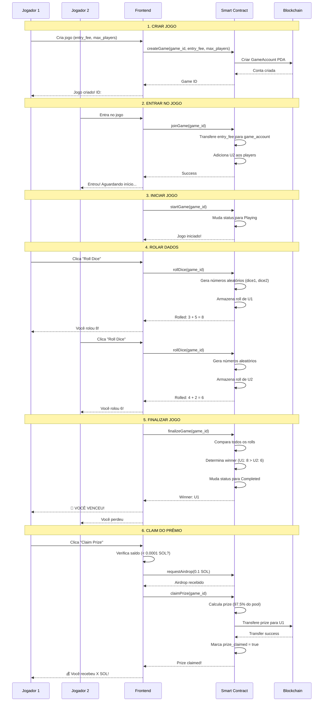

# 🎲 Dice Game - Jogo de Dados na Solana

Um jogo de dados descentralizado construído na blockchain Solana, onde jogadores apostam SOL e o maior número nos dados vence!

## 🔗 Links Rápidos

**🎮 Demo Live:** [Acesse o Jogo](https://seu-dominio.pages.dev)

**📦 Smart Contract (Devnet):**
- **Program ID:** `42kX7N73TVX16fufFaEaN2nfev4zDTa5TbvdAqXYKPd3`
- **Solana Explorer:** [Ver Contrato](https://explorer.solana.com/address/42kX7N73TVX16fufFaEaN2nfev4zDTa5TbvdAqXYKPd3?cluster=devnet)

## 📋 Visão Geral

O Dice Game é um jogo totalmente on-chain onde:
- ✅ Jogadores apostam SOL em um sistema de escrow descentralizado
- 🎲 Cada jogador rola 2 dados (1-6 cada)
- 🏆 O maior total vence e leva 97.5% do pool (2.5% de taxa)
- 🔐 Todos os fundos são mantidos seguros no smart contract
- ⚡ Suporta partidas 1v1 e multiplayer (até 6 jogadores)

## 🎮 Como Funciona

### Modos de Jogo

**1. 1v1 (Duelo)**
- Dois jogadores apostam a mesma quantia
- Cada um rola seus dados
- Maior soma vence tudo

**2. Multiplayer (até 6 jogadores)**
- Vários jogadores entram no mesmo jogo
- Todos apostam a mesma entry fee
- Após todos rolarem, o maior total leva o prêmio

### Fluxo do Jogo

```
1. Criar Jogo → 2. Entrar/Apostar → 3. Rolar Dados → 4. Finalizar → 5. Receber Prêmio
```

## 📊 Diagrama de Fluxo de Interação



## 🏗️ Arquitetura do Smart Contract

### Instruções Principais

| Instrução | Descrição | Quem pode chamar |
|-----------|-----------|------------------|
| `create_game` | Cria um novo jogo com entry fee e max players | Qualquer um |
| `join_game` | Entra em um jogo existente e paga entry fee | Qualquer um |
| `start_game` | Inicia o jogo quando players suficientes | Apenas creator |
| `roll_dice` | Rola os dados (gera números aleatórios) | Apenas players |
| `finalize_game` | Calcula vencedor após todos rolarem | Qualquer um |
| `claim_prize` | Vencedor resgata o prêmio | Apenas winner |
| `emergency_withdraw` | Retira fundos se jogo não começou | Apenas players |

### Estrutura da GameAccount

```rust
pub struct GameAccount {
    pub game_id: u64,              // ID único do jogo
    pub creator: Pubkey,           // Quem criou
    pub entry_fee: u64,            // Quanto cada player paga (lamports)
    pub max_players: u8,           // Máximo de jogadores (2-6)
    pub current_players: u8,       // Quantos já entraram
    pub total_pool: u64,           // Total de SOL no pool
    pub status: GameStatus,        // Waiting/Playing/Completed/Cancelled
    pub players: Vec<Pubkey>,      // Lista de endereços dos players
    pub rolls: Vec<Option<DiceRoll>>, // Resultado dos dados de cada um
    pub winner: Option<Pubkey>,    // Quem ganhou
    pub prize_claimed: bool,       // Prêmio já foi resgatado?
}
```

### Estados do Jogo

```
Waiting → Playing → Completed
   ↓         ↓
Cancelled  Cancelled
```

## 🚀 Deploy e Configuração

### Pré-requisitos

```bash
# Node.js 18+
node --version

# Solana CLI
solana --version

# Anchor Framework 0.30+
anchor --version
```

### Instalação

```bash
# Clone o repositório
git clone https://github.com/seu-usuario/vault-gaming-solana.git
cd vault-gaming-solana

# Instale dependências
npm install

# Configure a rede
solana config set --url devnet
```

### Build do Contrato

```bash
# Build do programa Solana
anchor build

# Deploy na devnet
anchor deploy --provider.cluster devnet

# Copie o Program ID e atualize:
# - client/src/idl/dice_game.json (campo "address")
# - Anchor.toml (campo "dice_game")
```

### Configuração do Frontend

```bash
cd client

# Crie arquivo .env
cp .env.example .env

# Configure as variáveis:
# VITE_SOLANA_NETWORK=devnet
# VITE_DICE_GAME_PROGRAM_ID=SEU_PROGRAM_ID_AQUI

# Inicie o dev server
npm run dev
```

O app estará disponível em `http://localhost:5173`

## 💻 Como Usar

### Para Jogar

1. **Conecte sua Wallet**
   - Clique em "Connect Wallet"
   - Escolha Phantom, Solflare ou outra wallet

2. **Crie um Jogo (1v1)**
   - Vá em "Dice Game" → "Create Game"
   - Digite o ID do jogo (ex: 12345)
   - Digite o entry fee (ex: 0.1 SOL)
   - Max players: 2
   - Clique "Create Game"

3. **Segundo Jogador Entra**
   - Abra em outra aba/browser (com outra wallet)
   - Vá em "Join Game"
   - Digite o mesmo Game ID (12345)
   - Clique "Join Game"

4. **Rolem os Dados**
   - Ambos clicam "Roll Dice"
   - Aguarde a transação confirmar
   - Resultados aparecem na tela

5. **Finalize e Claim**
   - Sistema finaliza automaticamente
   - Vencedor clica "Claim Prize"
   - SOL é transferido automaticamente!

### Para Jogar Multiplayer

1. Crie jogo com `max_players` = 3-6
2. Compartilhe o Game ID
3. Todos entram e rolam
4. Vencedor (maior roll) leva tudo

## 🔐 Segurança

### Proteções Implementadas

- ✅ **Escrow Descentralizado**: Fundos ficam no smart contract, não com terceiros
- ✅ **PDA (Program Derived Addresses)**: Contas determinísticas e seguras
- ✅ **Validações On-Chain**: Todas as regras são verificadas na blockchain
- ✅ **Prevenção de Re-entrancy**: Proper state management
- ✅ **Checagem de Saldo**: Frontend verifica saldo antes de transações
- ✅ **Airdrop Automático**: Em devnet, adiciona SOL se necessário para taxas

### Taxas

- **Taxa da Plataforma**: 2.5% do pool total
- **Prêmio do Vencedor**: 97.5% do pool total
- **Taxa de Rede Solana**: ~0.000005 SOL por transação

## 🛠️ Stack Tecnológico

**Smart Contract:**
- Rust + Anchor Framework 0.30
- Solana Program Library (SPL)
- Program Derived Addresses (PDAs)

**Frontend:**
- React 18 + TypeScript
- Vite (build tool)
- Tailwind CSS
- Solana Wallet Adapter
- Framer Motion (animações)
- React Hot Toast (notificações)

**Deploy:**
- Cloudflare Pages / Vercel
- Solana Devnet/Mainnet

## 📁 Estrutura do Projeto

```
vault-gaming-solana/
├── programs/
│   └── dice_game/
│       ├── src/
│       │   ├── lib.rs              # Ponto de entrada
│       │   ├── state.rs            # GameAccount struct
│       │   ├── error.rs            # Erros customizados
│       │   └── instructions/       # Lógica de cada instrução
│       │       ├── create_game.rs
│       │       ├── join_game.rs
│       │       ├── roll_dice.rs
│       │       ├── finalize_game.rs
│       │       └── claim_prize.rs
│       └── Cargo.toml
├── client/
│   ├── src/
│   │   ├── pages/
│   │   │   ├── DiceGamePage.tsx    # 1v1
│   │   │   └── DiceMultiplayerPage.tsx # Multiplayer
│   │   ├── lib/
│   │   │   ├── useDiceGame.ts      # Hook com métodos
│   │   │   └── anchorProgram.ts    # Setup do Anchor
│   │   ├── contexts/
│   │   │   └── DiceGameContext.tsx # Provider
│   │   └── idl/
│   │       └── dice_game.json      # IDL gerado
│   └── package.json
├── Anchor.toml
└── README.md
```

## 🧪 Testando

```bash
# Executar testes do Anchor
anchor test

# Rodar testes específicos
anchor test -- --features test

# Build e test juntos
npm run test
```

## 🎯 Roadmap

- [ ] Sistema de ranking on-chain
- [ ] Suporte para SPL tokens (além de SOL)
- [ ] Torneios automáticos
- [ ] NFTs de conquistas
- [ ] Mobile app (React Native)
- [ ] Integração com Pyth Oracle para aleatoriedade verificável

## 📄 Licença

MIT License - veja [LICENSE](LICENSE)

## 👨‍💻 Desenvolvedor

Desenvolvido por **Pedro Gattai**

- GitHub: [@seu-usuario](https://github.com/seu-usuario)
- Twitter: [@seu-twitter](https://twitter.com/seu-twitter)

## 🙏 Agradecimentos

- [Solana Foundation](https://solana.com) pela infraestrutura
- [Anchor Framework](https://www.anchor-lang.com/) pelo framework
- [Superteam Brasil](https://superteam.fun/) pela comunidade

---

**⚠️ Aviso:** Este projeto está na devnet. Para produção, faça auditoria de segurança completa antes de usar na mainnet com fundos reais.

**🎲 Divirta-se jogando!**
